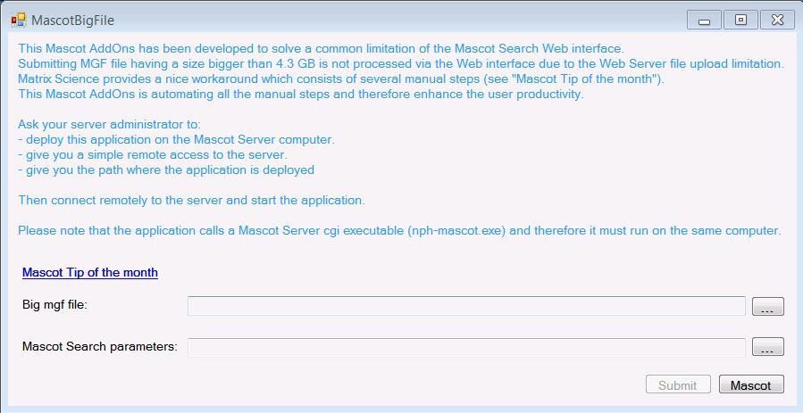

<h2>MascotBigFile repository was migrated to internal bitbucket. To get access please contact with Roche DevTools Support</h2>
#MascotBigFile: a .NET C# fat client application used to submit Mascot mgf (Mascot Generic File format) having a size bigger than 4.3GB.

##What is MascotBigFile?
It is simply an implementation of the [Mascot tip of the month from February 2016](http://www.matrixscience.com/nl/201602/newsletter.html)
With the new Mass Spectrometer instrument big data files are generated weekly.
Uploading Mgf files via the Mascot Search Web interface isn't possible when the size is becoming critical (above 4.3GB).

To bypass this frontier and make the job easy for our Proteomics users,
we have implemented the manual step by step process described by the Mascot tip of the month from February 2016

##Deployment
1. Ask your administrator to deploy this executable on the computer where Mascot Server is installed.
2. Ask him to have simple remote access to this computer because in order to use it you need to run it directly on the Mascot computer where all Mascot cgi applications are directly accessible by MascotBigFile (especially nph-mascot.exe).

##How to use it?
Submitting a basic Mascot search takes only four steps:

1. Start the application and select the big Mascot Mgf file.
 
2. Select the Mascot Search parameters file (*.inp) generated by following the first three steps of the [Mascot tip of the month](http://www.matrixscience.com/nl/201602/newsletter.html).

3. Press the button Submit and wait till the process is finished.
A Command Prompt windows is automatically opened and show you the progression of the execution.
Please note that it may take a few minutes up to an hour depending of the size of the mgf file.

4. Once the Command Prompt has disappeared you can press the Mascot button to view the results of the search.

## License
MascotBigFile is released under version 2.0 of the [Apache License](https://www.apache.org/licenses/LICENSE-2.0).
